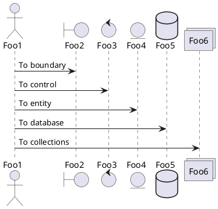

온라인에서 무료로 UML을 그리는 툴 중에서 이라는 사이트가 있다. 해당 사이트에서 다양한 기능을 제공 하고 있다. 본 글에서는 GitHub Page에서 PlantUML을 사용 할 수 있는 방법을 알아 본다.

# PlantUML

텍스트를 기반으로 UML을 그려주는 툴 중에 하나이다. 온라인에서 바로 UML을 그려 볼 수 있다. VS Code Plugin등 다양한 곳에서 사용할 수 있도록 지원하고 있다.

# Jekyll에서 Plantuml 사용하기

## GitHub Pages에서 랜더링 (안됨)

md 파일에서 텍스트로 작성되어 있는 UML 내용을 GitHub Page에서 랜더링해서 보여주는 방법을 찾아보고 있지만 별 방법이 없는것 같다.

## 이미지 링크를 삽입하는 방법

### 서론

PlantUML에서 링크를 이용한 방법이다.

아래의 링크를 들어가 보면

[http://www.plantuml.com/plantuml/png/SoWkIImgAStDuNBAJrBGjLDmpCbCJbMmKiX8pSd9noxea9gN0jG10000](http://www.plantuml.com/plantuml/png/SoWkIImgAStDuNBAJrBGjLDmpCbCJbMmKiX8pSd9noxea9gN0jG10000)

UML을 실시간으로 확인 할 수 있다.

### 적용 방법

이것을 md파일에 아래처럼 이미지 링크를 추가 한다.

``` markdown

```

최종적으로 아래의 그림처럼 이미지가 추가된것을 확인 할 수 있다.


## 추가




# 결론

Github Page에서 랜더링을 통해 보여줄 수 있으면 PlantUML 서버에 문제가 발생한 경우에도 UML을 그려줄 수 있을것이라고 생각한다. PlantUML도 사기업에서 만든 툴이기 때문에 언제 사라질지 예상할 수 없다. 그래서 UML을 텍스트로 표시하는 보편적인 방법이 있는지 확인해 볼 필요가 있다.